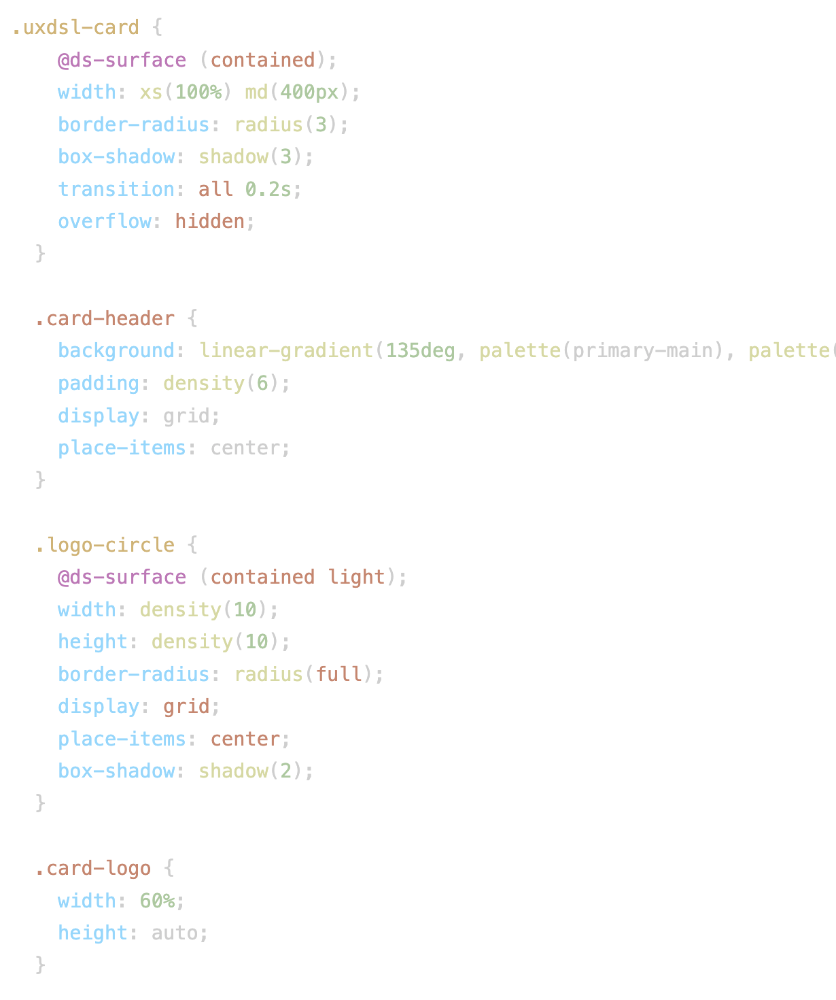

# postcss-uxdsl

<p align="center">
  
</p>

> **The core PostCSS engine for UXDSL** — a type-safe design system language.

[](https://www.npmjs.com/package/postcss-uxdsl)
[](LICENSE)

<p align="center">
  <a href="https://uxdsl.vercel.app/">
    
  </a>
</p>

---

## Overview

`postcss-uxdsl` transforms `.uxdsl` files into optimized CSS. It is typically used alongside `uxdsl-cli` or within frameworks like Next.js and Vite to power your design system.

It enables features like:
- **Variables**: `$primary: #000;`
- **Responsive Functions**: `width: xs(100%) md(50%);`
- **Theme Tokens**: `color: palette(primary-main);`
- **Smart Mixins**: `@ds-button primary;`


---

## Quick Start

This package works best when initialized with the CLI.

### 1. Install
```bash
npm install -D postcss-uxdsl uxdsl-cli concurrently
```

### 2. Initialize
Auto-configure your project (creates `uxdsl.config.cjs` and entry files).
```bash
npx uxdsl init
```

### 3. Connect & Run
Import the generated CSS in your root layout (e.g., `src/app/layout.tsx`) and start the watcher.

```tsx
// src/app/layout.tsx
import '../src/uxdsl.css';
```

```json
// package.json
"scripts": {
  "dev": "concurrently \"npx uxdsl build --watch\" \"next dev\""
}
```

---

## Syntax Preview



For a deep dive into Smart Mixins, Theming, and Component Packs, please visit the official documentation.

---

## Breakpoints (source of truth)

The default breakpoint map is centralized and exported from the runtime:

- `postcss-uxdsl/ds-runtime` → `DEFAULT_BREAKPOINTS`

Canonical defaults:

```ts
{ xs: 0, sm: 480, md: 768, lg: 1024, xl: 1280 }
```

Use this exported constant in integrations instead of duplicating literal values.

### Runtime breakpoint API

The runtime supports live breakpoint updates by rewriting generated media queries:

```ts
import { breakpoints } from 'postcss-uxdsl/ds-runtime'

breakpoints.get()                     // current map
breakpoints.set({ md: 900 })         // apply new values
breakpoints.update('lg', 1200)       // update one token
breakpoints.reset()                  // reset to initial map
breakpoints.load()                   // load persisted map from localStorage
```

<p align="center">
  <a href="https://uxdsl.vercel.app/docs/home">
    <strong>Explore the Full Docs &rarr;</strong>
  </a>
</p>

---

## License

MIT © [Ricardo Santoyo](https://github.com/rsantoyo-dev)
